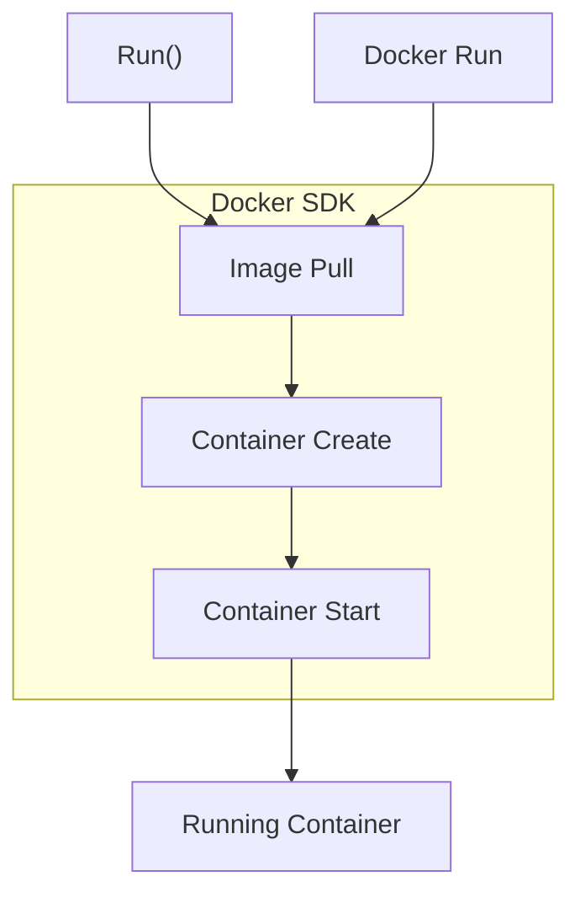

## Docker SDK Flow

```mermaid
flowchart TB
    Run["Run()"]
    dockerRun["Docker Run"]

    Run --> imagePull
    dockerRun --> imagePull

    subgraph dockerSDK["Docker SDK"]
        imagePull["Image Pull"]
        containerCreate["Container Create"]
        containerStart["Container Start"]

        imagePull --> containerCreate
        containerCreate --> containerStart
    end

    containerStart --> runningContainer["Running Container"]
```
