# Task State Diagram

```mermaid
stateDiagram-v2

    classDef Running fill:#2E4D6B
    classDef Scheduled fill:#FF6220,color:black
    classDef Completed fill:#B9F27C,color:black
    classDef Failed fill:#E0095F
    classDef Condition fill:#5C6684
    
    schedule: Can the task be scheduled?
    task_start: Does the task start succesfully?
    task_stop :Does the task stop succesfully?

    state has_schedule <<choice>>
    state has_task_started <<choice>>
    state has_task_stopped_succesfully <<choice>>
    

    [*] --> Pending
    Pending --> schedule
    schedule --> has_schedule
    has_schedule --> Scheduled :Yes 
    has_schedule --> Failed :No

    Scheduled --> task_start
    task_start --> has_task_started
    has_task_started --> Running :Yes
    has_task_started --> Failed :No


    Running --> task_stop
    task_stop --> has_task_stopped_succesfully
    has_task_stopped_succesfully --> Completed :Yes
    has_task_stopped_succesfully --> Failed :No
    
    Failed --> [*]
    Completed --> [*]

    class Scheduled Scheduled
    class Running Running
    class Completed Completed
    class Failed Failed
    class schedule Condition
    class task_start Condition
    class task_stop Condition
```

# State Transition
| Current State | Event | Next State |
| - | - | - |
| Pending | ScheduleEvent | Scheduled |
| Pending | ScheduleEvent | Failed |
| Scheduled | StartTask | Running |
| Scheduled | StartTask | Failed |
| Running | StopTask | Completed |
